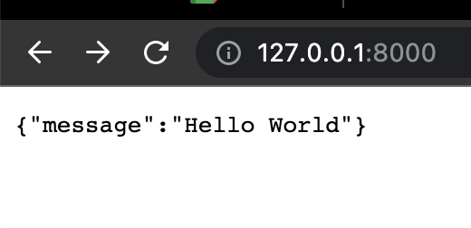
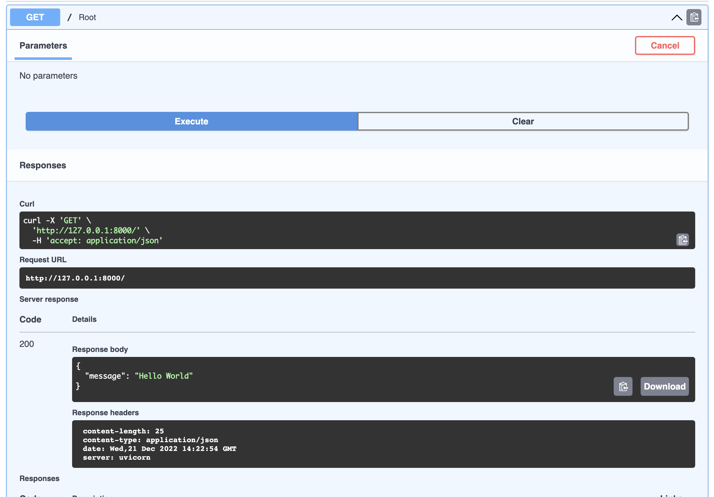

# Creating a simple API

## Basic structure

We will get started with a simple API and expand on it later. Our current goal is to set up our app and write a few GET routes.

Earlier on this course, we installed the **FastAPI** package, if we want to use it with its modules, we need to import it on a file. We still don't have any files, so let's create a `main.py` and import `fastapi` in there, we also want to initialize our app and write the first endpoint.

```py
# 1. Import package fastAPI
from fastapi import FastAPI

# 2. Create a FastAPI "instance"
app = FastAPI()

# 3. Write the first endpoint
@app.get("/")
async def root():
    return {"message": "Hello World"}
```

A few things about the code above:

- We first `import fastAPI`, FastAPI is a Python class that provides all the functionality for your API, this way we are able to use it on our file. Whenever working with packages, it's necessary to import them.

- The second thing we do is to `initialize the app` variable to create a server, you don't have to call it app, but it's a convention and highly recommended.

- And finally, we define our first endpoint, which always consists of two parts: the method with the path (in our case the method is `GET` and the path is `/`) and an async function with a return.

- Once we run the app and reach the endpoint, we should see `{"message": "Hello World"}` on the screen.

## Run Server

After adding that code to our `main.py` file, it's time to run our server, for this we are going the use the `uvicorn` package we installed in the set up. Let's have a look at the command and try to understand it before running:

- `uvicorn main:app --reload`

1. **uvicorn:** we use it to run our server

2. **main:** name of the file

3. **app:** name of the variable associated to fastapi

4. **--reload:** the `--reload` flag is watching for changes on project files, so we don't have to constantly restart the server

Now, run it on your terminal and have a look at the output.

```shell
# expected output

...
INFO:     Uvicorn running on http://127.0.0.1:8000 (Press CTRL+C to quit)
INFO:     Started reloader process [76363] using WatchFiles
INFO:     Started server process [76365]
INFO:     Waiting for application startup.
INFO:     Application startup complete.
```

## Testing

### Checking the output

With our server up and running, it's time to check if we are actually sending data, for that you need to navigate to http://127.0.0.1:8000/ or http://localhost:8000/, you can also find this address on your terminal where the server is running, just `cmd` + `click` on it to open on the browser.

Once you go to that address, you should be greeted with `{"message":"Hello World"}`

<!-- image 1 -->


Note that we go `/` because that's the path we defined for the endpoint, try changing the path to something else like `/test`, refresh the page and you should be greeted with "Not found". Now, navigate to `/test` and the previous message should be there.

### Interactive API docs

Now go to http://127.0.0.1:8000/docs, you will see the automatic interactive API documentation, this is provided and integrated by default in your application. All your endpoints will be displayed here and you can test them directly. Right now, we only have one to test, click on the following:

- GET -> Try it out -> Execute



There you can see the **request**, **response** and the **headers**, don't worry too much about the headers right now, we will discuss it later on in the course.

## Summary

1. Import `FastAPI`
2. Create an `app` instance
3. Write an endpoint
   1. First the path with the method
   2. Write a function with an appropriate return
4. Run the server with `uvicorn`
5. Navigate to http://127.0.0.1:8000 and also check the interactive docs
