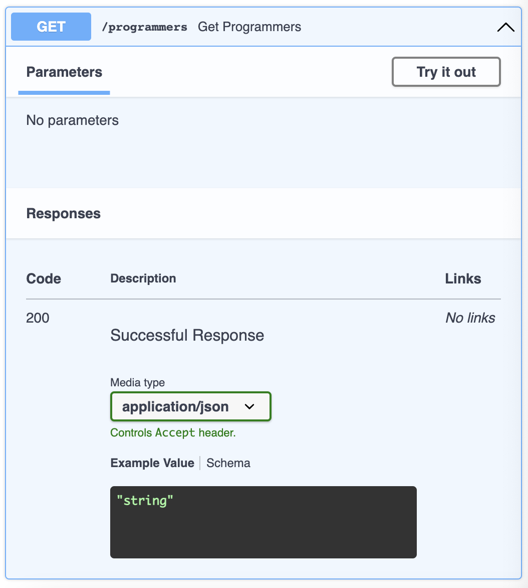
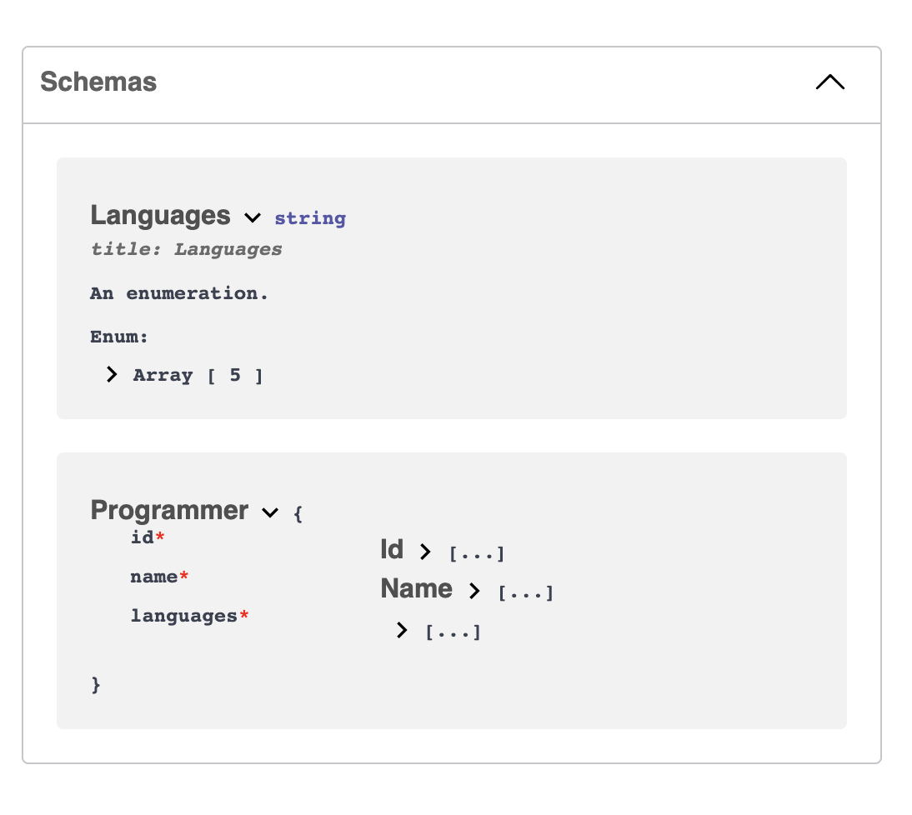
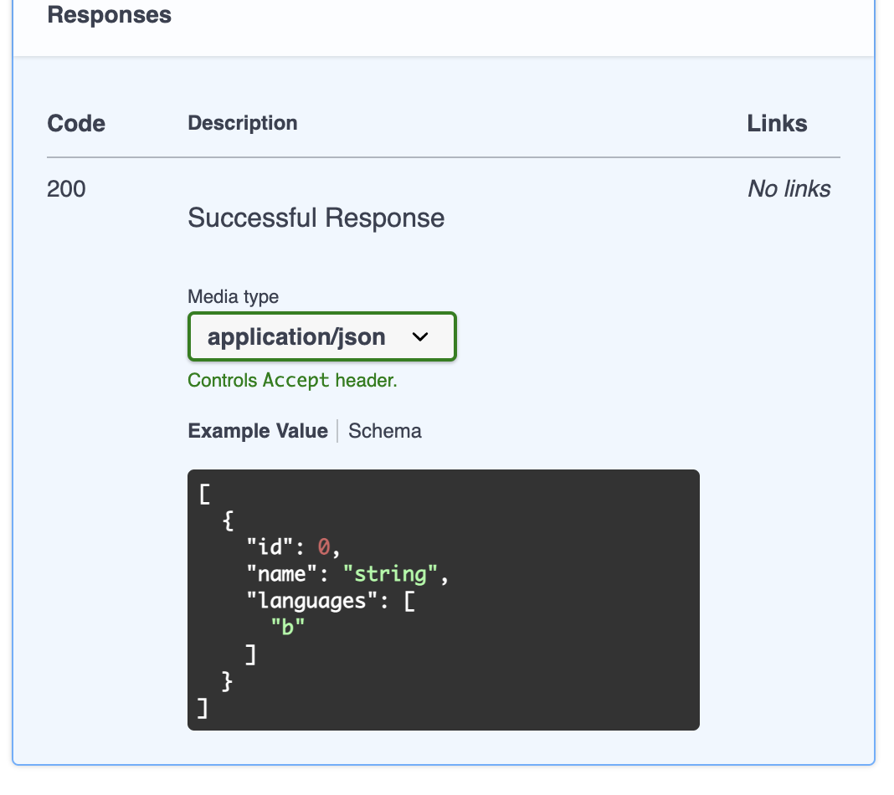

# Expanding our API

We just built a very simple API that runs on http://127.0.0.1:8000 and has one `GET` endpoint registered on the `/` path. Our focus for this next part is to add a few more endpoints and send more complex data. You will also learn a few more concepts:

- Path Parameters
- Query Parameters
- Request Body

If you don't remember, here is the code from `main.py`. We will keep working on this file and expand it.

```py
from fastapi import FastAPI

app = FastAPI()

@app.get("/")
async def root():
    return {"message": "Hello World"}
```

When it comes to endpoints, we can return way more than a single string, let's add a few more that return different types of data. We also want to make our app somewhat more meaningful, than it's better if we define proper objectives.

## What are we building?

Let's build an application about famous programmers, we want to have at least 2 different sets of data: programmers and programming languages. When it comes to the endpoints, we can write at least 2:

- `/programmers`: responds with a list of programmers
- `/programmers/id`: responds with a specific programmer

For the last one, we will need to use something called **path parameters**, we will get to that later in this lesson.

The one problem we still have to solve is where to get the data to send, since we don't have a database yet. For now, we can simply hardcode it, all we need is a list of programmers so we can send it on the response.

FastAPI and [pydantic](https://docs.pydantic.dev/) work very well together, it's also very helpful to have our data typed, we will make sure to type most of our data from now on.

## Setting up Mock DB

### Part 1 - Programmer Model

Create a new file in the root of your directory called `models.py`, we will use it to define models with pydantic. The first model we want to create is the Programmer one.

1. Install pydantic: `pipenv install pydantic`
2. Import BaseModel from pydantic

```py
# /models.py

from pydantic import BaseModel
```

3. Define a Programmer model with id and name

```py
# /models.py

...
class Programmer(BaseModel):
  id: int
  name: str
```

4. The programmer class is missing a third property `languages`. Languages is a list of strings with some predefined values. Create a new class Languages with some sample data.

```py
# /models.py

from enum import Enum

class Languages(str, Enum):
  c = "c"
  python = "python"
  javascript = "javascript"
```

5. Add a new property languages to the Programmer class.

```py
# /models.py

from typing import List

class Programmer(BaseModel):
  id: int
  name: str
  languages: List[Languages]
```

### Part 2 - Database

With our models ready, we need to create some mock data to serve as our database. On `main.py`:

1. import both models and List
2. define a variable db
3. Set db equal to a list of Programmers with id, name and languages

```py
# [...]

from models import Programmer, Languages
from typing import List

# [...]

db: List[Programmer] = [
    Programmer(id= 1, name="Dennis Ritchie", languages=[Languages.b, Languages.c]),
    Programmer(id= 2, name="Brian Wilson Kernighan", languages=[Languages.c]),
    Programmer(id= 3, name="James Gosling", languages=[Languages.java]),
    Programmer(id= 4, name="Guido van Rossum", languages=[Languages.python]),
    Programmer(id= 4, name="Brendan Eich", languages=[Languages.javascript])
]
```

Now that we have our _database_ ready, we can use fastAPI to send data to our clients.

## Endpoints

### fastAPI & Pydantic

You already saw that we can use Pydantic to define our models, we can also take a step ahead and use it to define the responses we send from our endpoints. Let's take a moment to understand the problem.

1. Go to `main.py` and write a second GET endpoint on the `/programmers` path. Send the db as a response.

```py
@app.get("/programmers")
async def get_programmers():
    return db
```

To test the code, visit http://127.0.0.1:8000/programmers, you should see a list of programmers on the screen. If you don't see it, make sure you are running your app and start debugging from there.

Another way we have to test out code is by checking the docs provided by fastAPI. Go to http://127.0.0.1:8000/docs and you should see at least two GET routes, one on `/` and the second on `/programmers`. Open the second one and check its description, you want to look at the **Successful Response**.

<!-- image 3 -->


There we can see that the type of our response is _string_, but this is not accurate, since we are sending a _list_ of programmers. This is not an error, it happens because the function alone can not predict the response, so it just adds string as the type of the json.

We can improve this by using Pydantic to type our responses. We will need to modify our endpoint a little, just to add the type definition there, for this we will use the **response model** property on the decorator:

```py
@app.get("/programmers", response_model=list[Programmer])
```

and also add the type to the function:

```py
async def get_programmers() -> list[Programmer]:
```

If you go to http://127.0.0.1:8000/docs, you will notice that we have a Schema, the JSON Schemas of your pydantic models will be part of the OpenAPI generated for your application and will be shown in the interactive API documentation.

<!-- image 4 -->


You can see that the attributes of Programmer in the docs are exactly the ones you declared with your pydantic model. These JSON Schemas will also be used in the API documentation inside each path operation that needs them. Go ahead and check the programmer response, now you should no longer see the _string_, but the actual model structure.

<!-- image 5 -->


---

[Next → Exercises](https://karlaevelize.github.io/fastapi-starter/docs/fastapi-starter/6-EXERCISES)

---
